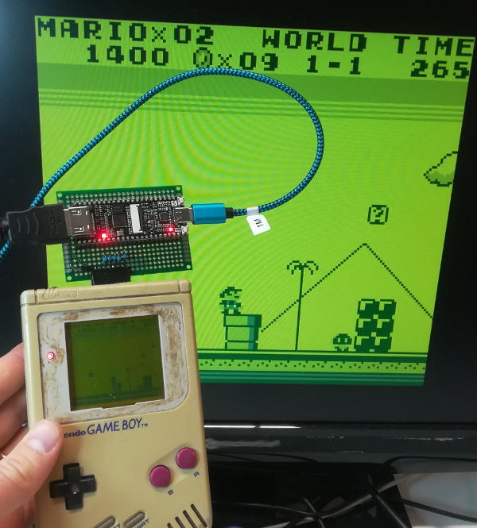

GbHdmi
======

HDMI version of project [GbVga](https://github.com/Martoni/GbVga), aim to
display GameBoy (DMG) on HDMI screen.

This project aim to demonstrate the HDMI feature of Gowin FPGA on Tang Nano 4K
and the power of Chisel HDL language for hardware generation.

[Demonstration in video](https://youtu.be/-JO6fnmHNhc).

## Bill of material

* [GameBoy DMG](https://en.wikipedia.org/wiki/Game_Boy)
* [Tang Nano 4K](http://www.fabienm.eu/flf/reception-du-kit-tang-nano-4k/)
