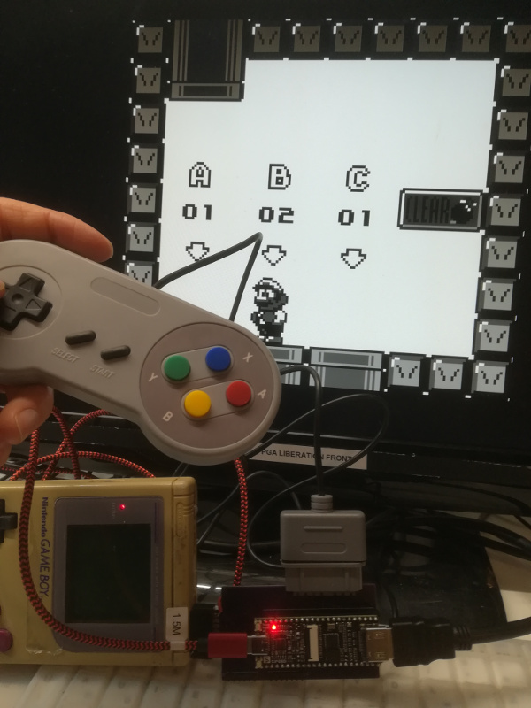

GbHdmi
======

HDMI version of project [GbVga](https://github.com/Martoni/GbVga), aim to
display GameBoy (DMG) on HDMI screen and play with Super NES Joypad.





This project aim to demonstrate the HDMI feature of Gowin FPGA on Tang Nano 4K
and the power of Chisel HDL language for hardware generation.

* [Demonstration in video](https://youtu.be/-JO6fnmHNhc).
* [Demonstration in video with Super Nes Joypad](https://www.youtube.com/watch?v=fpuqvUVp__I).

#GbHdmi was awarded at the [Digitronix Nepal competition](https://www.digitronixnepal.com/2021/10/winner-2nd-International-FPGA-design-competition.html).

## Dependances

To generate the core some additionnal Chisel library are required to be
published locally :

- [GbVga](https://github.com/Martoni/GbVga):

```Shell
$ git clone https://github.com/Martoni/GbVga.git
$ cd GbVga/chisel/
$ sbt publishLocal
```

- [fpgamacro](https://github.com/Martoni/fpgamacro):

```Shell
$ git clone https://github.com/Martoni/fpgamacro
$ cd fpgamacro
$ sbt publishLocal
```

- [HdmiCore](https://github.com/Martoni/HdmiCore):

```Shell
$ git clone https://github.com/Martoni/HdmiCore
$ cd HdmiCore
$ sbt publishLocal
```

## Core generation

To generate verilog using HdmiCore :

```Shell
$ sbt "runMain gbhdmi.TopGbHdmiDriver
```

Verilog BlackBoxed sources are available in directory `src/verilog` and pinout/constraints in `src/constraints`.

## Bill of material

* [GameBoy DMG](https://en.wikipedia.org/wiki/Game_Boy)
* [Tang Nano 4K](http://www.fabienm.eu/flf/reception-du-kit-tang-nano-4k/)
